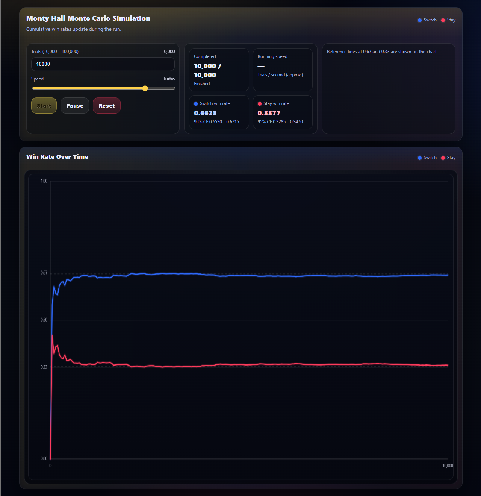

# Monty Hall Monte Carlo Simulation

## Overview

This project is an interactive Monte Carlo simulation of the classic Monty Hall problem. The simulation demonstrates the difference in winning probability between staying with an initial door selection and switching after the host reveals a losing door.

The application performs thousands of randomized trials and visualizes the cumulative win rates for both strategies in real time.

## Objective

The goal of this project is to illustrate how simulation can be used to validate theoretical probability results and demonstrate the power of Monte Carlo methods.

The expected probabilities are:

* Stay Strategy ≈ 33.3%
* Switch Strategy ≈ 66.7%

## Features

* Real-time simulation of up to 100,000 trials
* Interactive controls for simulation speed
* Dynamic visualization of cumulative win rates
* 95% confidence intervals
* Responsive web interface
* Custom HTML

## Technologies Used

* VScode
* HTML

## Results

As the number of trials increases, the simulation converges toward the theoretical probabilities:

| Strategy | Expected Win Rate |
| -------- | ----------------- |
| Stay     | 33.3%             |
| Switch   | 66.7%             |

The visualization demonstrates the Law of Large Numbers, showing how empirical results approach theoretical expectations as sample size grows.

## Key Takeaways

* Monte Carlo simulation can be used to validate theoretical probability models.
* Increasing sample size reduces variability in observed outcomes.
* Switching doors provides approximately twice the probability of winning compared to staying with the original choice.

## Future Improvements

* Additional probability simulations
* Exportable simulation results
* Multiple visualization modes
* Statistical hypothesis testing functionality

## Simulation Dashboard

## Final Results

## Author

Jay Weil

M.S. Business Analytics
B.S. Electrical Engineering
University of Cincinnati
